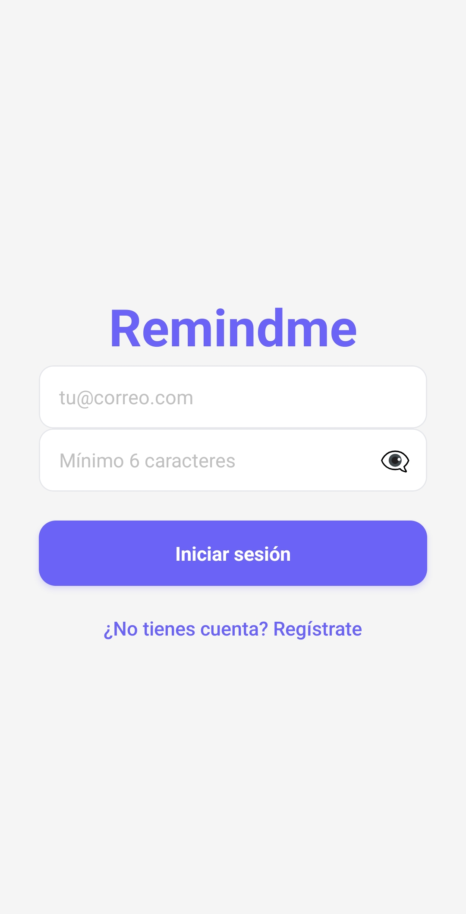
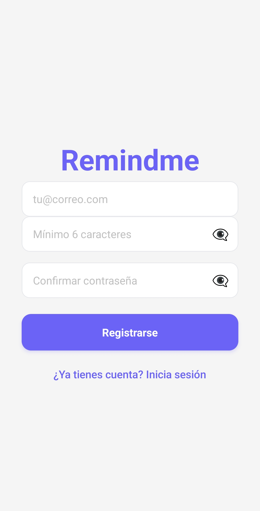
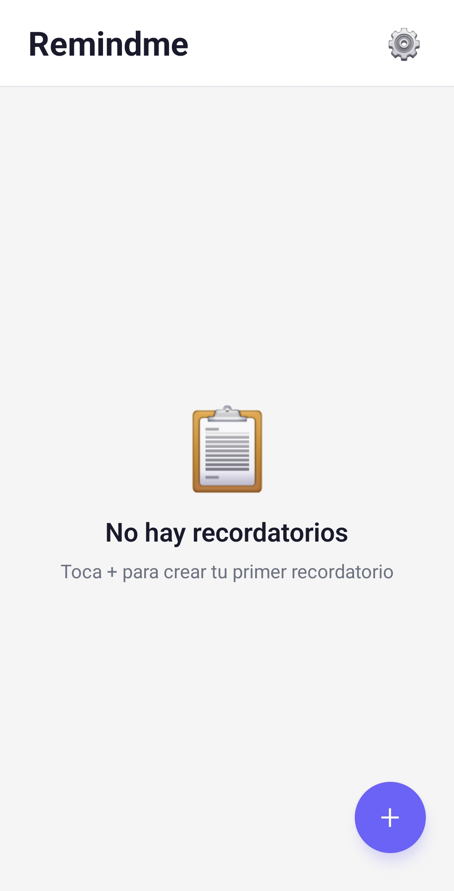
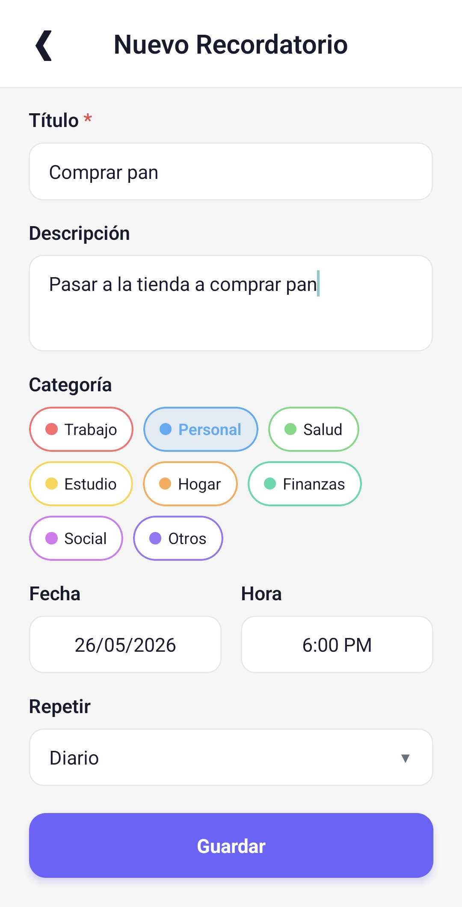
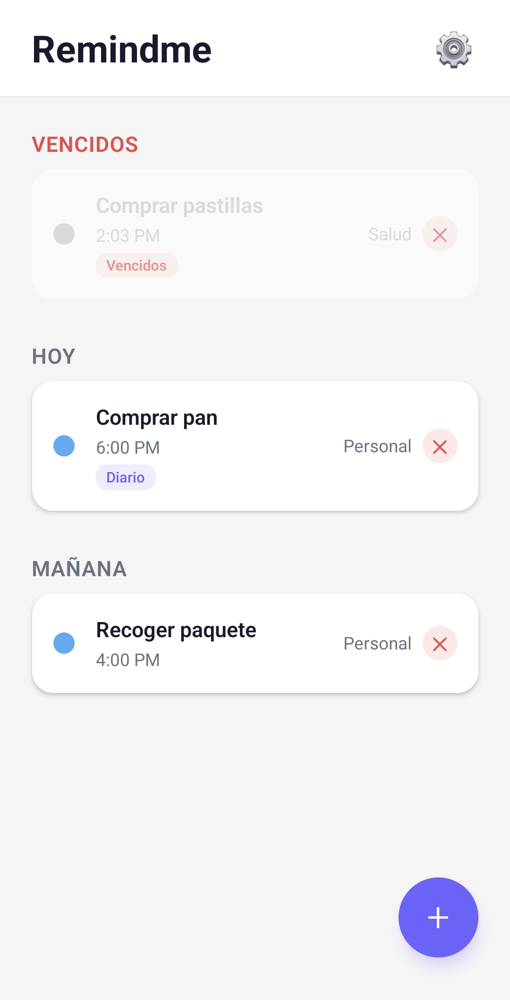
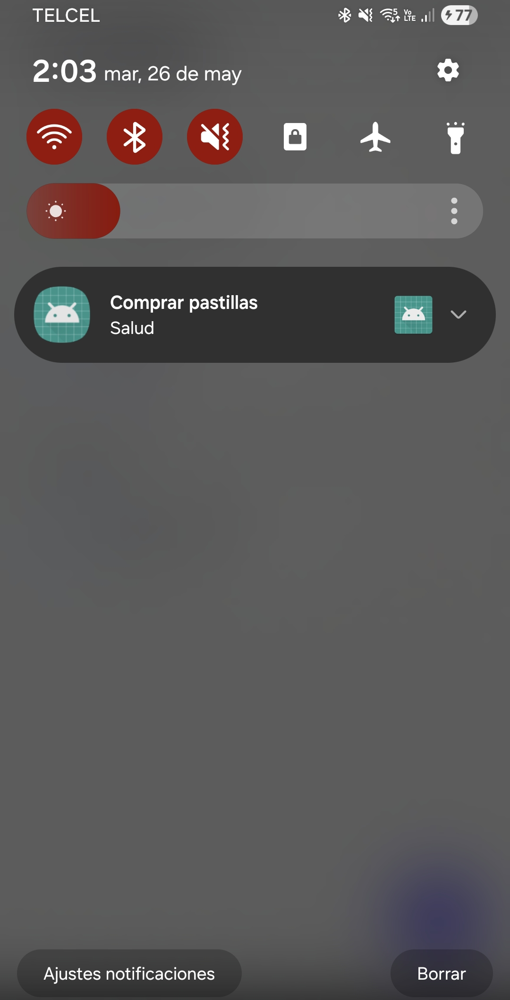
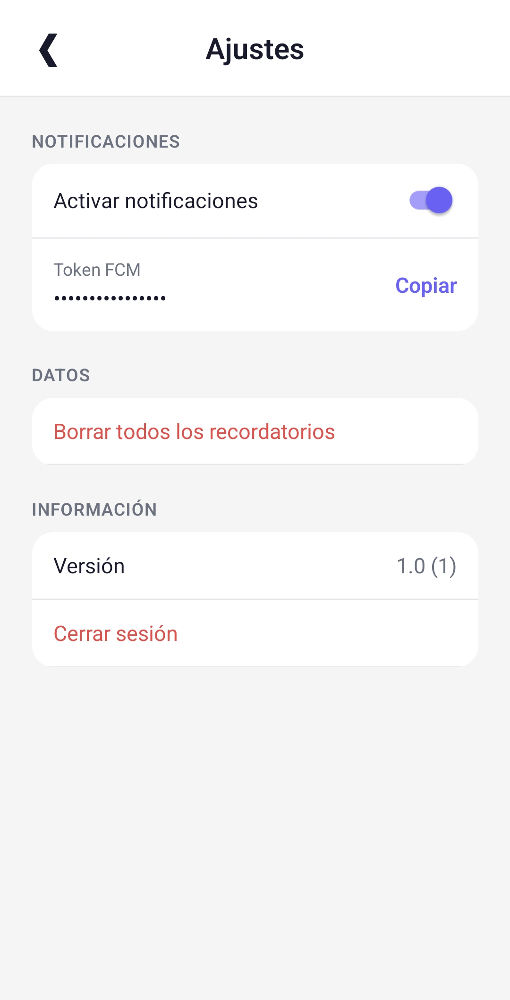

# 📋 Remindme

**React Native** · **Firebase Auth** · **Cloud Firestore** · **FCM** · **Notifee**

---

## Screenshots

<p float="left">
  
  
  
  
  
  
  
</p>

## Capturas

<p float="left">
  
  
  
  
  
  
  
</p>

---

## Features

- Email/password authentication with Firebase Auth
- Real-time reminders sync with Cloud Firestore
- Scheduled local notifications via Notifee (daily/weekly repeat support)
- FCM token retrieval for push notification capability
- Color-coded categories (Work, Personal, Health, Study, Home, Finance, Social, Other)
- Reminder sections: Today, Tomorrow, Upcoming, Expired
- Create, edit, and delete reminders
- Notification toggle (enable/disable all)
- Offline persistence (Firestore cache)
- Multi-language support (EN/ES)
- Password visibility toggle
- Copy FCM token to clipboard

## Características

- Autenticación con email/contraseña mediante Firebase Auth
- Sincronización de recordatorios en tiempo real con Cloud Firestore
- Notificaciones locales programadas con Notifee (soporte de repetición diaria/semanal)
- Obtención de token FCM para capacidad de notificaciones push
- Categorías por colores (Trabajo, Personal, Salud, Estudio, Hogar, Finanzas, Social, Otros)
- Secciones de recordatorios: Hoy, Mañana, Próximos, Vencidos
- Crear, editar y eliminar recordatorios
- Interruptor de notificaciones (activar/desactivar todas)
- Persistencia offline (caché de Firestore)
- Soporte multi-idioma (EN/ES)
- Botón para mostrar/ocultar contraseña
- Copiar token FCM al portapapeles

---

## Tech Stack / Stack Tecnológico

| Technology / Tecnología | Usage / Uso |
|---|---|
| [React Native](https://reactnative.dev) 0.85 | Cross-platform mobile framework |
| [Firebase Auth](https://firebase.google.com/docs/auth) | Email/password authentication |
| [Cloud Firestore](https://firebase.google.com/docs/firestore) | Real-time NoSQL database |
| [Firebase Cloud Messaging](https://firebase.google.com/docs/cloud-messaging) | Push notification token |
| [Notifee](https://notifee.app) | Local scheduled notifications |
| [React Navigation](https://reactnavigation.org) | Stack navigation |
| [AsyncStorage](https://github.com/react-native-async-storage/async-storage) | Local preferences storage |
| [react-native-localization](https://github.com/balancedtech/react-native-localization) | i18n (EN/ES) |

---

## Architecture / Arquitectura

```
App.tsx
  └─ SafeAreaProvider
      └─ Router
          └─ AuthProvider                  ← Firebase Auth state
              ├─ (no user) LoginScreen     ← Auth form
              └─ (user) ReminderProvider   ← Firestore + notifications
                  └─ NavigationContainer
                      ├─ HomeScreen             ← Reminder list
                      ├─ CreateReminderScreen   ← Create/Edit form
                      └─ SettingsScreen         ← Preferences, logout
```

### Data flow / Flujo de datos

**English**: Reminders are stored in a flat `reminders/` Firestore collection (not nested under users). The `ReminderProvider` subscribes to real-time updates via `onSnapshot`, sorts them client-side by date+time, and syncs scheduled notifications with Notifee. Authentication state is managed by `AuthProvider` via `onAuthStateChanged`.

**Español**: Los recordatorios se almacenan en una colección plana `reminders/` de Firestore (no anidada bajo usuarios). `ReminderProvider` se suscribe a actualizaciones en tiempo real mediante `onSnapshot`, ordena por fecha+hora del lado del cliente y sincroniza notificaciones programadas con Notifee. El estado de autenticación lo gestiona `AuthProvider` mediante `onAuthStateChanged`.

---

## Project Structure / Estructura del Proyecto

```
src/
├── components/
│   ├── LoginScreen.js            # Auth form / Formulario de autenticación
│   ├── HomeScreen.js             # Reminder list / Lista de recordatorios
│   ├── CreateReminderScreen.js   # Create/Edit form / Formulario crear/editar
│   ├── SettingsScreen.js         # App settings / Ajustes
│   ├── Globals.js                # Theme, i18n, config / Tema, i18n, configuración
│   └── Router.js                 # Navigation + auth gate / Navegación + control de auth
├── context/
│   ├── AuthContext.js            # Firebase Auth provider
│   └── ReminderContext.js        # Firestore CRUD provider
└── services/
    └── NotificationService.js    # Notifee + FCM logic / Lógica de notificaciones
```

---

## Getting Started / Comenzando

### Prerequisites / Prerrequisitos

**English**:
- Node.js >= 22.11.0
- React Native CLI setup ([guide](https://reactnative.dev/docs/set-up-your-environment))
- Android device or emulator
- Firebase project ([console](https://console.firebase.google.com))

**Español**:
- Node.js >= 22.11.0
- React Native CLI configurado ([guía](https://reactnative.dev/docs/set-up-your-environment))
- Dispositivo Android o emulador
- Proyecto de Firebase ([consola](https://console.firebase.google.com))

### Installation / Instalación

```sh
git clone https://github.com/your-user/remindme.git
cd remindme
npm install
```

### Firebase Configuration / Configuración de Firebase

**English**:

1. Go to [Firebase Console](https://console.firebase.google.com)
2. Create a new project (or use existing)
3. Add an Android app with package name `com.remindme`
4. Download `google-services.json` and place it in `android/app/`
5. Enable **Authentication** → **Sign-in method** → **Email/Password**
6. Create a Firestore database and add a collection named `reminders`

**Español**:

1. Ve a [Firebase Console](https://console.firebase.google.com)
2. Crea un nuevo proyecto (o usa uno existente)
3. Agrega una app Android con package name `com.remindme`
4. Descarga `google-services.json` y colócalo en `android/app/`
5. Habilita **Authentication** → **Sign-in method** → **Email/Password**
6. Crea una base de datos Firestore y agrega una colección llamada `reminders`

### Run / Ejecutar

```sh
npx react-native run-android
```

---

## Firebase Security Rules / Reglas de Seguridad

**English**: The following rules ensure users can only read and write their own reminders.

**Español**: Las siguientes reglas aseguran que los usuarios solo puedan leer y escribir sus propios recordatorios.

```
rules_version = '2';
service cloud.firestore {
  match /databases/{database}/documents {
    match /reminders/{id} {
      allow read, update, delete: if request.auth != null
        && resource.data.userId == request.auth.uid;
      allow create: if request.auth != null
        && request.resource.data.userId == request.auth.uid;
    }
  }
}
```

**Note**: The unique constraint `userId == request.auth.uid` works because the app stores the authenticated user's UID in the `userId` field of each document.

**Nota**: La restricción `userId == request.auth.uid` funciona porque la app almacena el UID del usuario autenticado en el campo `userId` de cada documento.

---

## License / Licencia

MIT
